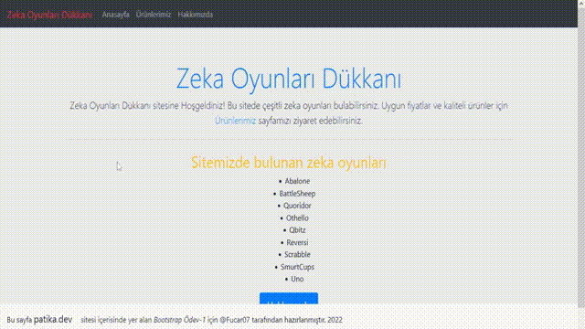

# Bootstrap Ödev-1

Kodluyoruz Eğitimi için Bootstrap konusunda birinci ödevim.

Aşağıdaki ekran görüntüsü yer almaktadır.

## Google Tarihçe
>Bootstrap, duyarlı, mobil öncelikli ön uç web geliştirmeye yönelik ücretsiz ve açık kaynaklı bir CSS çerçevesidir. Tipografi, formlar, düğmeler, gezinme ve diğer arayüz bileşenleri için CSS ve JavaScript tabanlı tasarım şablonları içerir. 
[Devamı için tıklayınız..](https://en.wikipedia.org/wiki/Bootstrap_(front-end_framework))
